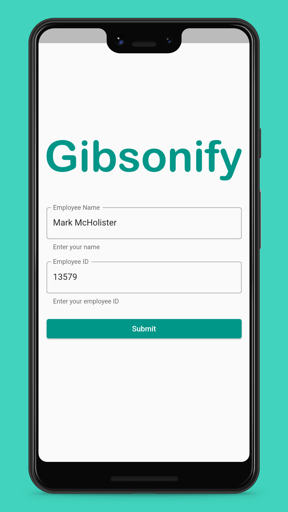
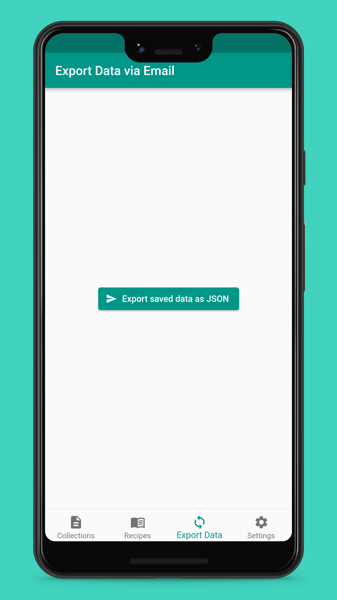

  

**Gibsonify** is a Flutter app designed to follow [Gibson's 24-hour methodology](https://www.gov.uk/research-for-development-outputs/an-interactive-24-hour-recall-for-assessing-the-adequacy-of-iron-and-zinc-intakes-in-developing-countries) for nutritional data collection.

 
    
    
     

## Description

The app follows the structure of the four passes of Gibson's methodology. It has been designed with prompts to help the enumerator carrying out the survey to make the process as intuitive as possible. Having been designed with offline usage in mind, it stores the recipes and all collected data locally on the device, allowing it to be exported at a future point.

## Installation

The latest stable Android version of Gibsonify can be downloaded as an `.apk` file by clicking the button below:

    

Instructions for verifying that you've downloaded the correct file are in [docs/release_verification.md](docs/release_verification.md). After downloading the `apk` file to your Android smartphone, you need to [allow installation of apps from unknown sources](https://www.maketecheasier.com/install-apps-from-unknown-sources-android/), and then tap on the `apk` file, and allow all other prompts to install it.

Releases on platforms other than Android are currently not officially supported, although they can be built by following the development instructions outlined in the section below.

<!--
TODO: Add Google Play Store & F-droid links?
-->

## Development

Instructions for developing Gibsonify are in [docs/development.md](docs/development.md).

## Authors and Acknowledgements

Gibsonify is being developed by [Faizaan Pervaiz](https://github.com/fpervaiz), [Archie Carpenter](https://github.com/Archie-C) and [Charlotte Rowe](https://github.com/Charlotte-Rowe), who have taken on the previous work of [Shazril Suhail](https://github.com/sshazril), [Adam Sroka](https://adamsroka.io), [Greg Chu](https://github.com/gregchu6), [Juan Rodgers](https://github.com/rodgersjuan), and [Choon Kiat Lee](https://github.com/choonkiatlee).

The development of the project is supervised by Alexandre Kabla ([University of Cambridge](https://www.cam.ac.uk), [Engineering Department](http://www.eng.cam.ac.uk/)) and Lara Allen ([Centre for Global Equality](https://centreforglobalequality.org)), in collaboration with Padmaja Ravula and Kavitha Kasala ([ICRISAT](https://www.icrisat.org/)). The project received support from [TIGR2ESS](https://www.globalfood.cam.ac.uk/keyprogs/TIGR2ESS).

## License

The source code of this project and all other content is licensed under the [Apache 2.0](https://www.apache.org/licenses/LICENSE-2.0) license.
